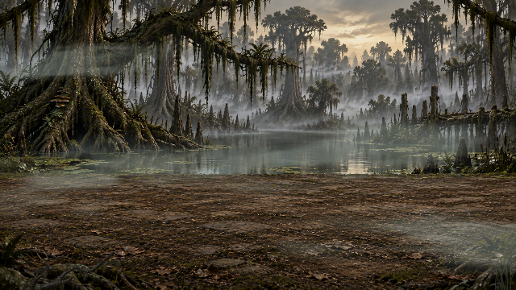
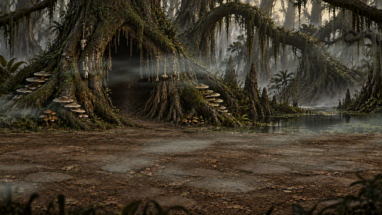
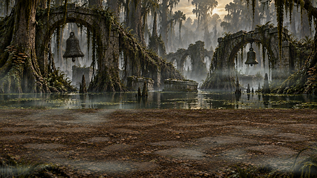
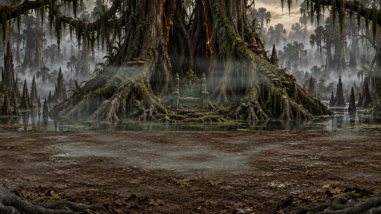

# Episode 2 background concepts

Current screenshots were captured from the native environment renderer at 5.3 seconds, with existing foreground and fog enabled. These are current art, not proposed replacements. No game changes in this review.

| Current scene | Proposed changes |
|---|---|
|  | **1. Leechwater Crossing — wind and wildlife.** Keep the open pool and huge left tree. Animate selected hanging moss strands and sparse edge reeds with irregular gusts; add a small heron on a distant stump that occasionally turns its head or preens. Replace the soft lower-left branch with crisp, thinner bark and twigs. Keep the center open. |
|  | **2. The Witch’s Hollow — hanging charms.** Keep the hollow tree and its existing bone decorations. Rebuild selected bone charms and rag strips as sharp, separately suspended objects: different swing lengths, slight rotation, brief cloth flutter. Reduce the upper-right foreground bough and replace the blurred bottom silhouettes with a few detailed roots at the corners. |
|  | **3. The Drowned Procession — funeral bells.** Preserve both bell arches. Rebuild both bells sharply with visible suspension and independently moving clappers. The large left bell swings more heavily; the smaller right bell moves at a different rhythm. A few hanging vines react to the same breeze. Keep foreground to a low broken branch and sparse reeds. No waterwheel. |
|  | **4. The Sunken Throne — ruined royalty.** Preserve the throne and giant root silhouette. Add two narrow, tattered royal standards beside the throne, with restrained, uneven cloth motion; small hanging metal ornaments turn gently. Keep the throne and boss silhouette clear. Replace the heavy foreground root blanket with crisp, lower corner pieces; remove soft swelling/root-scaling motion. |

Across all four: sharp opaque objects, credible pivots and weight, no frame crossfades, independent motion timing, and a restrained separate foreground layer. Keep existing water subdued rather than making it the signature animation everywhere. Fog stays soft but should not wash out the detailed foreground.

Capture command: Godot --path godot --script ../tools/godot/capture-swamp-review.gd -- --swamp-review
